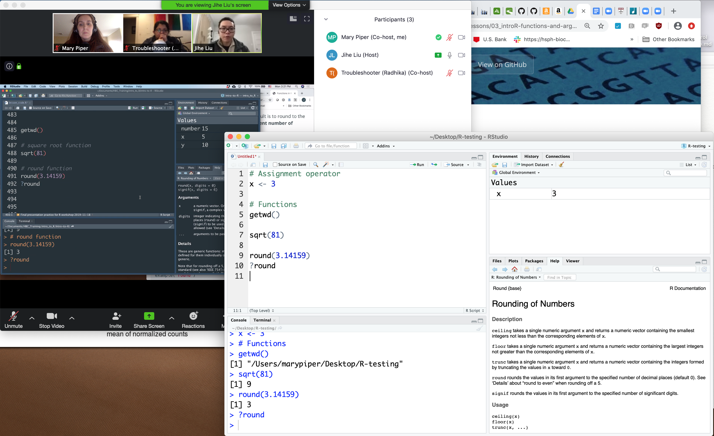

These guidelines are for learners taking a hands-on workshop online

### Setting up prior to workshop

* Quit/minimize all applications that are not required for class
* Download all required packages and install all required applications
  * Email the HBC Training Team if any of the downloads/installations are problematic
* Check sound quality on laptop and use headphones if possible
* We will be using Zoom for the workshop
  * We will provide a URL that can be used to join the classroom/meeting with a web browser or with the Zoom app
  * A Zoom account is NOT needed to join the class
* If a dual monitor is accessible, then this could be quite helpful, though definitely not necessary

### Getting started

* Quit/minimize all applications that are not required for class
* Mute yourself (the meeting host will do this, if you don't)
* Do not share your screen.
* Turn off video.
* In share screen setting, uncheck first box (enter full screen)
* Find the Chat window in Zoom
* Find the following buttons within the Chat sidebar
  * Raise hand
  * Check mark (equivalent to a green post-it) - "agree", "I'm ok"
  * Cross mark (equivalent to a red post-it) - "disagree", "I need help", "unsure"
* Set up the windows to best follow the workshop. 
  
  - Examples:
     * Teaching R with RStudio:
       
       * Zoom screen in upper left two-thirds of screen, RStudio in lower right two-thirds of screen, and materials on the right half side behind RStudio.
         

     
     * Teaching shell:
       
       * Zoom screen in upper right-hand half of screen, shell is left-hand half of screen with shell, and materials on the lower right-hand half of screen.

### During workshop - Getting questions answered, troubleshooting, etc.

#### Following along

* **Always have the workshop materials open**, and if you fall behind, you can catch up by following the materials. If unable to catch up on your own, you can direct message the Troubleshooter.

* **If Zoom gets disconnected**, just use the same meeting link used to connect initially to re-connect. Use the workshop materials to catch up, and, if unable to catch up on your own, direct message the Troubleshooter.

#### Questions

* **Presenter questions:** The Presenter will ask questions of the learners throughout the workshop and will ask for responses via red/green stickies or raised hands. Presenter may call on those with green stickies to provide answers or those with red or no stickies to determine any problems.

* **Technical learner questions:** Direct message the person labelled as 'Troubleshooter' with a description of the problem. Troubleshooter may be able to solve problem through direct message, but may ask you to join a breakout room to discuss in person, if necessary.

* **Conceptual learner questions:** 
  - When the Presenter asks for questions, then you can raise hand and instructor may call on you to ask. There is no guarantee that all questions will be addressed.
  - If question can wait until the end of the lesson, then post question in PollEverywhere and/or upvote relevant questions within PollEverywhere.

#### Transitions between lessons and breaks

* After each lesson, we will take a 5-10 minute break. The Presenter will inform you of the break.

###  Workshop follow up

* If questions come up after the workshop, then please email hbctraining@hsph.harvard.edu.
